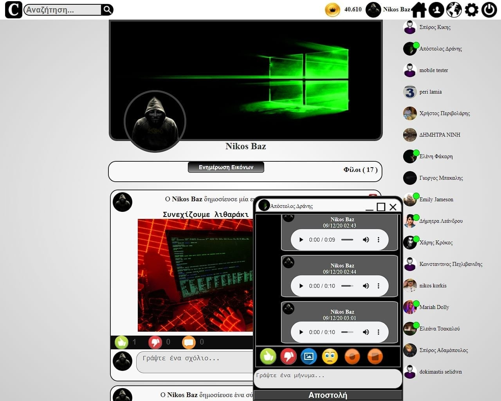

# Social Network With AI Bots
An Open Source Social Network Code With AI Bots

 

# Description

I release an old social network code with artificial intelligence that controlled Bot accounts.

Where Bots reacted like normal people on social networks that knew Greek and English philosophy, quotes, had preferences in youtube videos, Liked / disliked, sent and accepted friend requests, responded to Chat (In Greek) and more actions.

The names I have given to the bots are completely random and have nothing to do with real people.

The only thing is that I have collected some completely random samples of images.

To create the huge array of AI Bots knowledge I wrote code that would write this Array.And this huge Arrays is in scripts/AI-ffb.py.

This code has released to an old domain named fullhood.com.

# The new Social Network is on development but without AI Bots.

 

I have developed this code more and I have also given importance to security as a social network without AI Bots , but I opened the old code so that the example of the AI Bots exists and is accessible.

All versions are offline, but I hope to upload the new one without AI Bots to an online server in the coming months.

Those who want to support my effort can make a donation to my website <a href="https://sourcecode347.com">www.sourcecode347.com</a>

Those who want to participate in the development of any version of this social network, contact me at <a href="https://facebook.com/sourcecode347">SourceCode347 Official Facebook Page</a>
